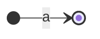
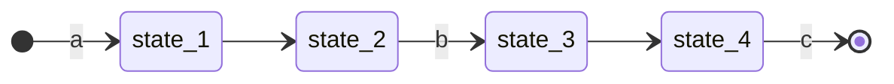
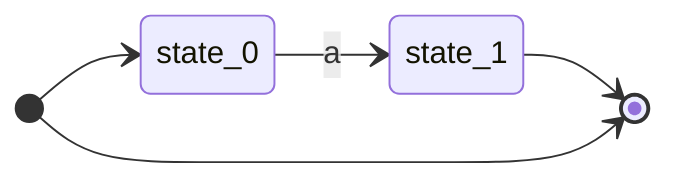
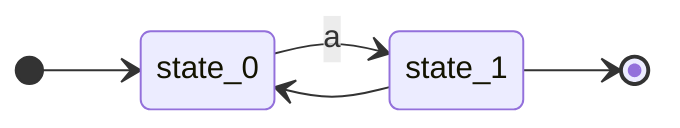
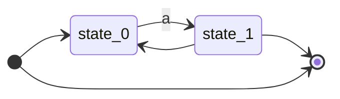
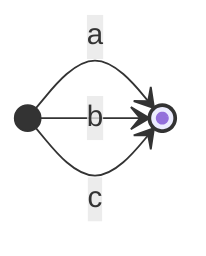
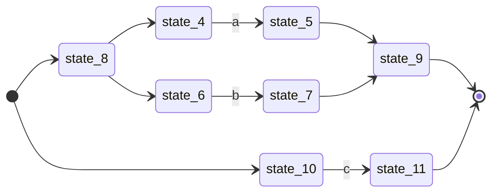
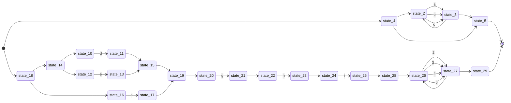

# NFA 可视化

<!-- @import "[TOC]" {cmd="toc" depthFrom=1 depthTo=6 orderedList=false} -->

<!-- code_chunk_output -->

- [1. 单字符NFA](#1-单字符nfa)
- [2. 多字符NFA](#2-多字符nfa)
- [3. 量词](#3-量词)
  - [3.1. ?](#31-)
  - [3.2. +](#32-)
  - [3.3. \*](#33-)
- [4. 字符集](#4-字符集)
- [5. 选择](#5-选择)
- [6. 复杂案例](#6-复杂案例)

<!-- /code_chunk_output -->

## 1. 单字符NFA

a:

## 2. 多字符NFA

abc:

## 3. 量词

### 3.1. ?

a?:

### 3.2. +

a+:

### 3.3. *

a*:

## 4. 字符集

[abc]:

## 5. 选择

a|b|c:

## 6. 复杂案例

[abc]*|(d|e|f)ghi[2-5]+:

