# 正则表达式可视化

[TOC]

## 1. 单字符

regexp: `a`

nfa:

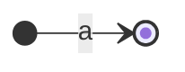

dfa:

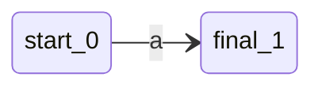

minimized_dfa:

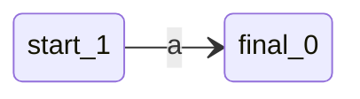

## 2. 多字符

regexp: `abc`

nfa:

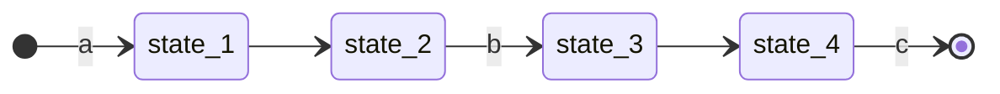

dfa:

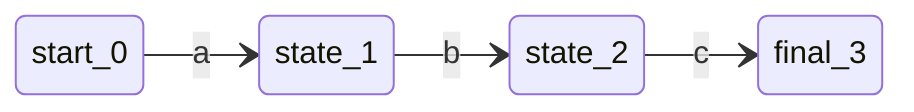

minimized_dfa:

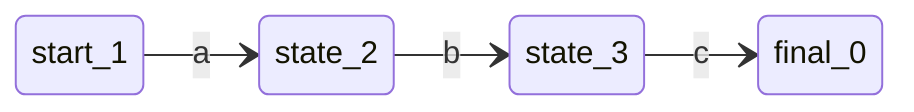

## 3. 量词

### 3.1. ?

regexp: `a?`

nfa:

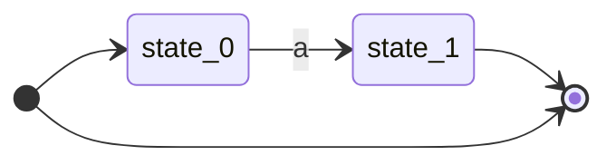

dfa:


minimized_dfa:


### 3.2. +

regexp: `a+`

nfa:

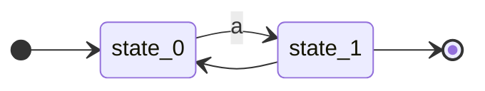

dfa:


minimized_dfa:

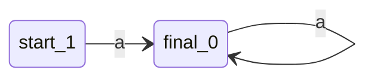

### 3.3. *

regexp: `a*`

nfa:

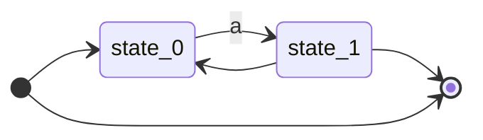

dfa:


minimized_dfa:

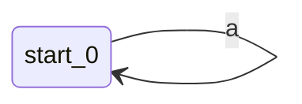

## 4. 字符集

regexp: `[abc]`

nfa:

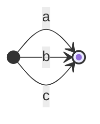

dfa:

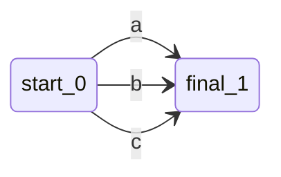

minimized_dfa:

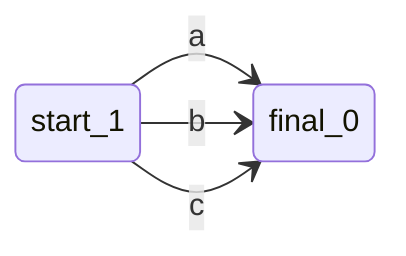

## 5. 选择

regexp: `a|b|c`

nfa:

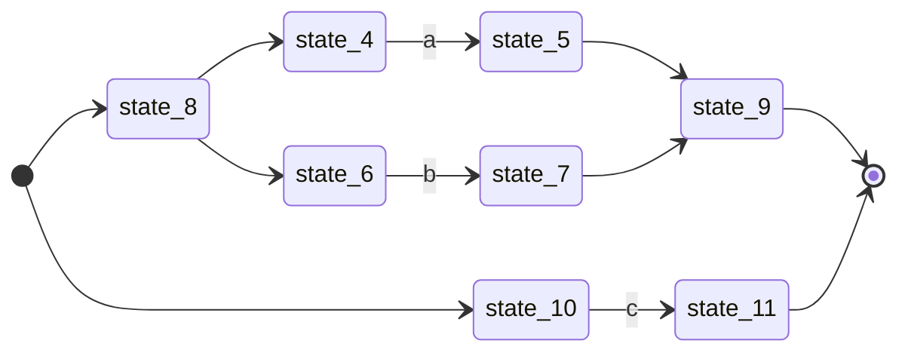

dfa:

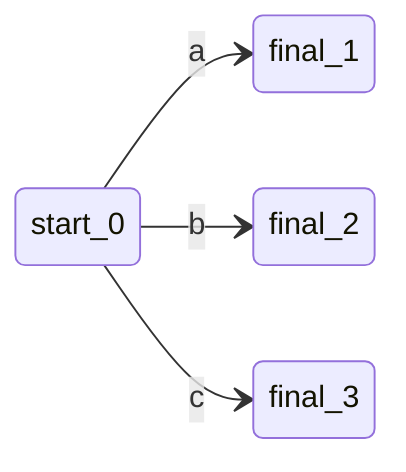

minimized_dfa:

```mermaid
stateDiagram-v2
direction LR

start_1 --> final_0 : a
start_1 --> final_0 : b
start_1 --> final_0 : c
```

## 6. 复杂案例

regexp: `[abc]*|(d|e|f)ghi[2-5]+`

nfa:

```mermaid
stateDiagram-v2
direction LR

state_2 --> state_3 : a
state_2 --> state_3 : b
state_2 --> state_3 : c
state_3 --> state_5
state_3 --> state_2
state_4 --> state_2
state_4 --> state_5
state_5 --> [*]
state_10 --> state_11 : d
state_11 --> state_15
state_12 --> state_13 : e
state_13 --> state_15
state_14 --> state_10
state_14 --> state_12
state_15 --> state_19
state_16 --> state_17 : f
state_17 --> state_19
state_18 --> state_14
state_18 --> state_16
state_19 --> state_20
state_20 --> state_21 : g
state_21 --> state_22
state_22 --> state_23 : h
state_23 --> state_24
state_24 --> state_25 : i
state_25 --> state_28
state_26 --> state_27 : 2
state_26 --> state_27 : 3
state_26 --> state_27 : 4
state_26 --> state_27 : 5
state_27 --> state_29
state_27 --> state_26
state_28 --> state_26
state_29 --> [*]
[*] --> state_4
[*] --> state_18
```

dfa:

```mermaid
stateDiagram-v2
direction LR

start_0 --> final_1 : a
start_0 --> final_1 : b
start_0 --> final_1 : c
start_0 --> state_2 : d
start_0 --> state_3 : e
start_0 --> state_4 : f
state_2 --> state_5 : g
state_3 --> state_5 : g
state_4 --> state_5 : g
state_5 --> state_6 : h
state_6 --> state_7 : i
state_7 --> final_8 : 2
state_7 --> final_8 : 3
state_7 --> final_8 : 4
state_7 --> final_8 : 5
final_1 --> final_1 : a,b,c
final_8 --> final_8 : 2,3,4,5
```

minimized_dfa:

```mermaid
stateDiagram-v2
direction LR

start_0 --> final_1 : a
start_0 --> final_1 : b
start_0 --> final_1 : c
start_0 --> state_3 : d
start_0 --> state_3 : e
start_0 --> state_3 : f
state_3 --> state_4 : g
state_4 --> state_5 : h
state_5 --> state_6 : i
state_6 --> final_2 : 2
state_6 --> final_2 : 3
state_6 --> final_2 : 4
state_6 --> final_2 : 5
final_1 --> final_1 : a,b,c
final_2 --> final_2 : 2,3,4,5
```

